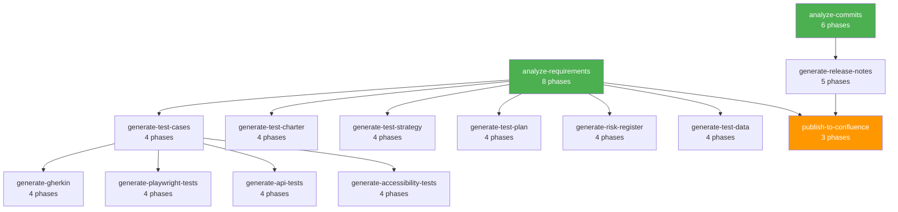
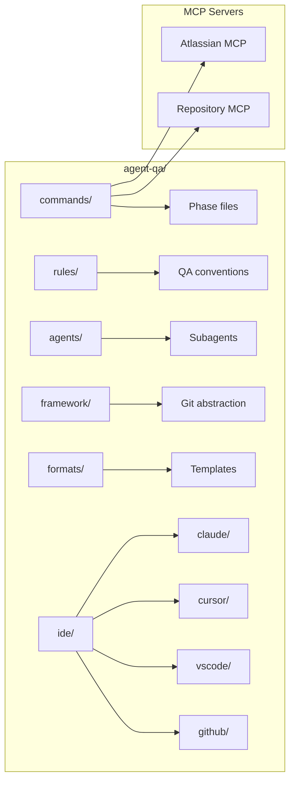

# Agent-QA

**AI-Powered Quality Assurance Automation Agent**

Agent-QA is an intelligent automation agent that helps QA analysts, managers, and release managers streamline their testing workflows by automatically analyzing Jira tickets, Confluence pages, and git repository changes to generate comprehensive test deliverables.

## What is Agent-QA?

Agent-QA automates the entire QA documentation workflow by:

- **Analyzing Requirements** from Jira tickets, epics, sprints, and releases
- **Extracting Content** from linked Confluence pages
- **Tracking Code Changes** from git commits and pull requests
- **Generating Test Deliverables** including test cases, strategies, charters, plans, risk registers, and release notes
- **Generating BDD Features** as Gherkin `.feature` files from test cases
- **Generating Playwright Tests** as `.spec.ts` files with Page Object Model
- **Publishing to Confluence** with automatic format conversion
- **Maintaining Traceability** between requirements, code changes, and test cases

## Key Features

### Core Capabilities

- **Requirements Analysis Engine** - Automatically extracts and structures requirements from Jira tickets with quality analysis
- **Test Case Generation** - Generates comprehensive test cases (positive, negative, edge cases) with Xray CSV export
- **Test Charter Generation** - Creates exploratory test charters with session-based testing approaches
- **Test Strategy Generation** - Develops comprehensive test strategies covering all test levels and types
- **Test Plan Generation** - Produces detailed test plans with schedules, entry/exit criteria, and deliverables
- **Risk Register Generation** - Automatically identifies, scores, and documents risks with mitigation strategies
- **Commit Analysis** - Analyzes git commits and correlates them with Jira tickets
- **Technical Release Notes** - Generates release notes with full requirement traceability
- **Gherkin/BDD Generation** - Converts test cases to Given/When/Then `.feature` files
- **Playwright Test Generation** - Generates `.spec.ts` files with Page Object Model from test cases
- **Confluence Publishing** - Converts deliverables to Confluence format, optionally publishes via MCP

### Integration Support

- **Atlassian MCP** - Jira and Confluence integration
- **Git Repository MCP** - GitLab, GitHub, or Azure DevOps support

### Multi-IDE Support

| IDE | Integration | Installed To |
|-----|------------|-------------|
| **Claude Code** | Slash commands, rules, subagents, hooks | `.claude/` |
| **Cursor** | Rules + Claude slash commands | `.cursor/`, `.claude/commands/` |
| **VS Code** | Settings, tasks, extensions + Copilot | `.vscode/`, `.github/` |
| **GitHub Copilot** | File references with copilot-instructions | `.github/` |
| **Other IDEs** | Direct file reference | — |

## Quick Start

### Prerequisites

- Access to Jira and Confluence (via Atlassian MCP server)
- Access to GitLab, GitHub, or Azure DevOps (via respective MCP servers)
- MCP servers configured in your IDE

### Installation

#### Option 1: Install from GitHub (when repository is available)

1. **Base Installation** (one-time setup):

   **macOS/Linux / Git Bash:**
   ```bash
   curl -sSL https://raw.githubusercontent.com/taouani/agent-qa/master/scripts/base-install.sh | bash
   ```

   **Windows (PowerShell):**
   ```powershell
   irm https://raw.githubusercontent.com/taouani/agent-qa/master/scripts/base-install.ps1 | iex
   ```

2. **Project Installation** (in your project directory):

   **macOS/Linux / Git Bash** (all IDE integrations):
   ```bash
   ~/agent-qa/scripts/project-install.sh                    # All IDEs (default)
   ~/agent-qa/scripts/project-install.sh --ide claude        # Claude Code only
   ~/agent-qa/scripts/project-install.sh --ide vscode,copilot # VS Code + Copilot
   ```

   **Windows (PowerShell):**
   ```powershell
   cd C:\path\to\your\project
   & "$env:USERPROFILE\agent-qa\scripts\project-install.ps1"              # All IDEs (default)
   & "$env:USERPROFILE\agent-qa\scripts\project-install.ps1" --ide claude  # Claude Code only
   & "$env:USERPROFILE\agent-qa\scripts\project-install.ps1" --ide vscode,copilot
   ```

#### Option 2: Install from Local Repository (if GitHub installation fails)

If you get a 404 error, the repository is not yet on GitHub. Install from your local copy:

1. **Navigate to the agent-qa repository**:
   ```bash
   cd /path/to/agent-qa
   ```

2. **Run local installation**:
   ```bash
   ./scripts/install-from-local.sh
   ```

3. **Project Installation** (in your project directory):

   ```bash
   ~/agent-qa/scripts/project-install.sh
   ```

   Or on Windows (PowerShell):

   ```powershell
   & "$env:USERPROFILE\agent-qa\scripts\project-install.ps1"
   ```

4. Follow the prompts to configure your repository platform and project ID.

For detailed installation instructions, see [INSTALLATION.md](INSTALLATION.md).

## Usage

### IDE-Specific Usage

**Claude Code / Cursor IDE:**
Commands are recognized automatically. Type `/` followed by the command name:
```
/analyze-requirements PROJ-123
/generate-test-cases
```

**VS Code / GitHub Copilot:**
Reference the command files directly. See [HOW_TO_USE.md](agent-qa/commands/HOW_TO_USE.md) for details.

### Basic Workflow

1. **Analyze Requirements**:
   ```
   /analyze-requirements PROJ-123
   ```
   or for a release/filter:
   ```
   /analyze-requirements "project = PROJ AND fixVersion = '1.0.0'"
   ```

2. **Generate Test Deliverables**:
   ```
   /generate-test-cases
   /generate-test-strategy
   /generate-test-charter
   /generate-test-plan
   /generate-risk-register
   ```

3. **Generate BDD / Playwright Tests** (from test cases):
   ```
   /generate-gherkin
   /generate-playwright-tests
   /generate-api-tests
   /generate-accessibility-tests
   ```

4. **Publish to Confluence**:
   ```
   /publish-to-confluence
   ```

5. **Generate Release Notes**:
   ```
   /generate-release-notes
   ```

### Output Structure

All outputs are organized by date and context:

```
agent-qa/
  YYYY-MM-DD-{folder-name}/
    requirements/          # Requirement analysis
    test-cases/           # Generated test cases (MD + CSV)
    test-strategy/        # Test strategy documents
    test-charter/         # Test charters
    test-plan/            # Test plans
    risk-register/        # Risk registers
    release-notes/        # Technical release notes
    commits/              # Commit analysis (if enabled)
    gherkin/              # Gherkin .feature files
    playwright/           # Playwright .spec.ts and page objects
```

Where `{folder-name}` is:
- Issue key for single issues (e.g., `PROJ-123`)
- `release` for multiple issues or JQL filters

## Documentation

- **[Installation Guide](INSTALLATION.md)** - Detailed installation and configuration instructions
- **[User Guide](USER_GUIDE.md)** - Comprehensive guide with examples and best practices
- **[Commands Reference](agent-qa/commands/README.md)** - Complete command documentation

## Architecture

### Command Dependency Chain



### Project Structure



### Design Principles

- **Multi-phase Commands** — Each command is broken down into numbered phases
- **MCP Server Integration** — Uses Model Context Protocol for external tool integration
- **Context-Aware Processing** — Automatically adapts terminology based on input type
- **Modular Design** — Commands can be run independently or in sequence
- **Centralized Structure** — All files live under `agent-qa/`, IDE integrations in `agent-qa/ide/`
- **Rules** — `agent-qa/rules/` for QA conventions, MCP usage, output standards, language handling
- **Subagents** — `agent-qa/agents/` for specialized QA tasks

## Configuration

Configuration is stored in `agent-qa/config.yml`:

```yaml
repository_platform: gitlab  # gitlab, github, or azure-devops
repository_project_id: "my-group/my-project"
azure_devops_cloud_id: ""  # Only for Azure DevOps

output_formats:
  confluence: false
  gherkin: false

confluence_space_key: ""
confluence_parent_page_id: ""

playwright_base_url: "http://localhost:3000"
```

## Available Commands

| Command | Description | Input |
|---------|-------------|-------|
| `analyze-requirements` | Analyze Jira issues and generate requirement docs | Jira issue key(s) or JQL filter |
| `generate-test-cases` | Generate test cases from requirements | User selection |
| `generate-test-strategy` | Generate test strategy document | User selection |
| `generate-test-charter` | Generate exploratory test charter | User selection |
| `generate-test-plan` | Generate comprehensive test plan | User selection |
| `generate-risk-register` | Generate risk register | User selection |
| `analyze-commits` | Analyze git commits and correlate with tickets | Jira filter or tickets |
| `generate-release-notes` | Generate technical release notes | User selection |
| `generate-gherkin` | Generate Gherkin .feature files from test cases | User selection |
| `generate-playwright-tests` | Generate Playwright .spec.ts from test cases | User selection |
| `publish-to-confluence` | Convert and publish deliverables to Confluence | User selection |
| `health-check` | Verify configuration and MCP connectivity | None |
| `validate-outputs` | Validate deliverables against QA rules | User selection |
| `generate-traceability-report` | Cross-deliverable coverage matrix | User selection |
| `generate-test-data` | Generate structured test data sets | User selection |
| `generate-api-tests` | Generate REST/GraphQL API test specifications | User selection |
| `generate-accessibility-tests` | Generate WCAG 2.1 AA accessibility tests | User selection |
| `regenerate` | Regenerate deliverables affected by requirement changes | User selection |
| `run-pipeline` | Execute multiple commands in sequence | Pipeline spec |

## Best Practices

1. **Start with Requirements Analysis** - Always run `analyze-requirements` first
2. **Use Context** - Generate commands will automatically use previous outputs as context
3. **Review Generated Content** - AI-generated content should be reviewed and refined
4. **Maintain Traceability** - Use the generated traceability matrices to track coverage
5. **Iterate** - Commands can be run multiple times as requirements evolve

## Contributing

Agent-QA is designed to be extensible. Key areas for contribution:

- Additional MCP server integrations
- Enhanced test case generation algorithms
- Additional output formats
- Integration with more testing tools

## License

[Add your license information here]

## Acknowledgments

Agent-QA leverages:

- MCP (Model Context Protocol) for tool integration
- Best practices from senior QA architect templates

## Support

For issues, questions, or contributions, please [open an issue](https://github.com/taouani/agent-qa/issues) or refer to the documentation.

---

**Ready to get started?** Check out the [Installation Guide](INSTALLATION.md) and [User Guide](USER_GUIDE.md)!
